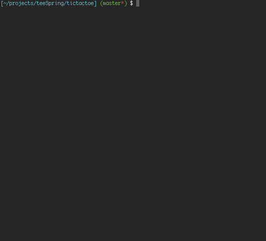

# Tictactoe

Simple Tic Tac Toe

## To test
	
	rake install
	irb
	require "tictactoe"
	Tictactoe.start

- Tape "help" during the game to show you the different possible movements
- You can let the computer playing with himself

## TODO

- Improve test coverage
- Try to replace the element of the board with the user object or empty string (" ")
- Move the Board#start method into a new class to simplify the code

## Installation

Add this line to your application's Gemfile:

    gem 'tictactoe'

And then execute:

    $ bundle

Or install it yourself as:

    $ gem install tictactoe

## Contributing

1. Fork it
2. Create your feature branch (`git checkout -b my-new-feature`)
3. Commit your changes (`git commit -am 'Add some feature'`)
4. Push to the branch (`git push origin my-new-feature`)
5. Create new Pull Request
